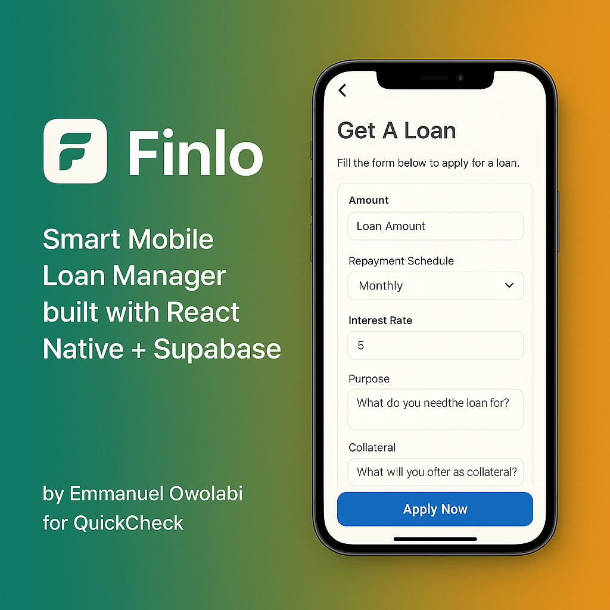
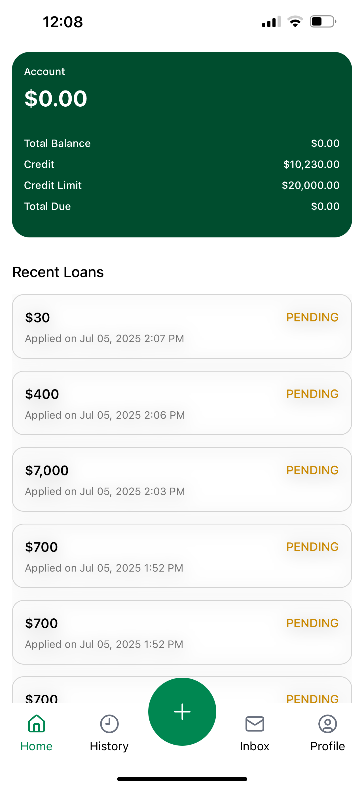
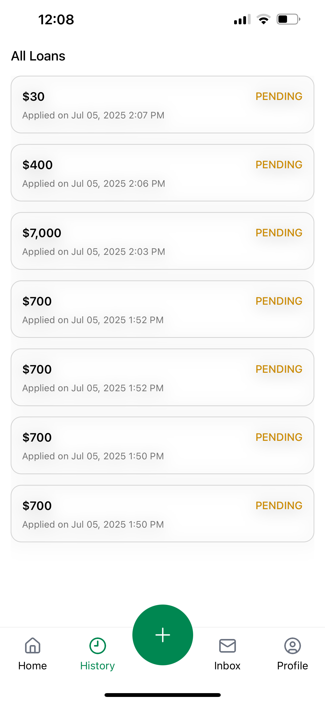
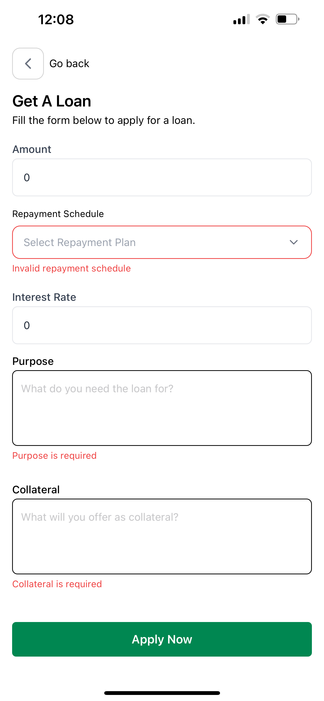
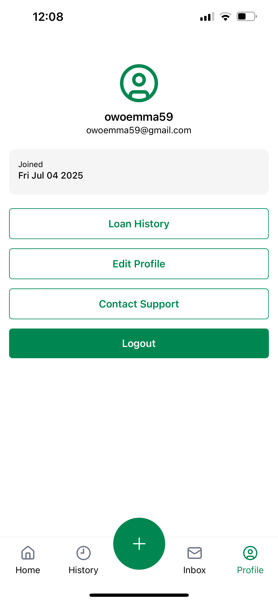
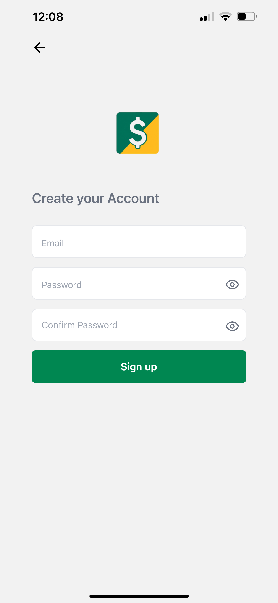

<p align="center">
  
</p>

# 💸 Finlo — Loan Management App

## 📸 Demo Screenshots

### 🏠 Home Screen



### 📝 History Screen



### 📃 Loan Form



### 📃 Profile Screen



### 📃 Login Screen


### 📃 Signup Screen



Finlo is a simple and intuitive **React Native** loan management application built with **Expo**, **Supabase**, and **Zustand**. It allows users to apply for loans, view their loan history, manage loan repayments, and maintain a dynamic profile — all in one place.

---

## ✨ Features

- 🔐 **Authentication** (login/signup via Supabase Auth)
- 🧾 **Loan Application Form** with real-time validation
- 💼 **Loan History** with status labels (Approved, Pending, Rejected, Flagged)
- 🔁 **Pull-to-Refresh** on recent loans
- 💀 **Delete Loans** with confirmation prompts
- 📊 **Dynamic Overview**: Tracks Total Balance, Credit, Credit Limit, and Due Payments
- ⚙️ **Custom Hooks & Reusable UI Components**
- 📦 **Global State Management** using Zustand
- 🌐 **Clean API Layer** with `useFetch` abstraction for Supabase interactions

---

## 🛠️ Tech Stack

| Tool/Library                  | Usage                                    |
| ----------------------------- | ---------------------------------------- |
| Expo + React Native           | Cross-platform mobile development        |
| Supabase                      | Backend-as-a-Service (Auth, DB, Storage) |
| Zustand                       | Global state management                  |
| React Hook Form + Yup         | Form validation and control              |
| Expo Router                   | Navigation and deep linking              |
| Tailwind CSS (via nativewind) | Styling with utility classes             |
| Toast                         | In-app notifications                     |

---

## 🚀 Getting Started

### 1. **Clone the repo**

```bash
git clone https://github.com/your-username/finlo-app.git
cd finlo-app
```

````

### 2. **Install dependencies**

```bash
npm install
```

### 3. **Run the development server**

```bash
npx expo start
```

Make sure you have the [Expo Go](https://expo.dev/client) app installed on your mobile device or use a simulator.

---

## 🔐 Supabase Setup

### ✅ What You'll Need

- Supabase **Project URL** (attached in the submission email)
- Supabase **Anon Public Key** (attached in the submission email)


### 📁 Environment Variables

Create a `.env` file in the root and add your Supabase credentials:

```env
SUPABASE_URL=https://your-project.supabase.co
SUPABASE_ANON_KEY=your-anon-key-here
```

These are used in the `lib/supabase.ts` file.

---

## 🧠 Developer Notes

- All Supabase interactions are abstracted into the `server/` folder as services
- `hooks/useFetch` handles loading, error, and async service calls in one hook
- Form validation is powered by `react-hook-form` and `yup`
- Global state (user/session) is handled with Zustand
- All screens are wrapped in `SafeAreaView` and responsive across devices
- Pull-to-refresh and skeleton loaders enhance UX
- Each tab is conditionally rendered to reflect app flow (`/get_loan` hides tab bar)

---

## 📬 Contact

Built with ❤️ by [Emmanuel Owolabi](https://github.com/nametheman)
For questions, shoot me an email.

---

## ✅ Submission Guide

- Run `npx expo start`
- Login using test credentials (or create a new user)
- Apply for a loan from the central **Apply** tab
- View your loan in **Home** and **History**
- Try deleting a loan to watch the UI sync dynamically
- Review your user profile from the **Profile** tab

---

> This project reflects my ability to design clean UI/UX, architect scalable frontend codebases, and integrate robust backends with real-world logic.

```

---

### ✅ Final Notes for You

- Drop in your Supabase credentials section when emailing
- Replace `https://github.com/your-username/finlo-app.git` with your actual repo
- Add demo screenshots/gifs to grab attention

```
````
